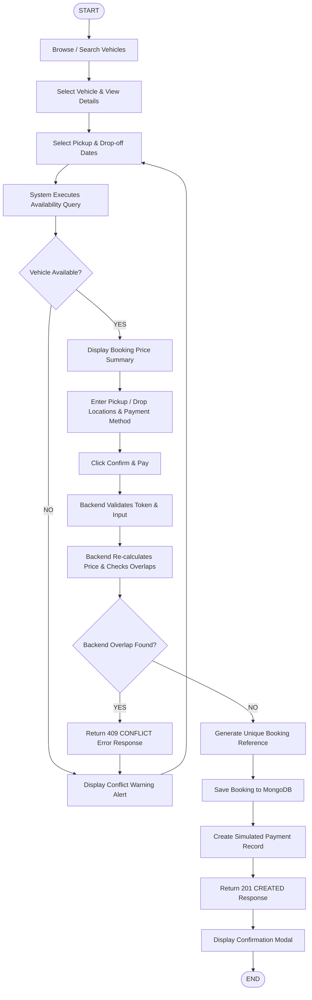

# Activity Diagram — Online Vehicle Booking System

## Overview
The Activity Diagram illustrates the operational control flow of a vehicle reservation from initial vehicle selection to final booking confirmation.

---

## Activity Flow Diagram (Mermaid)

