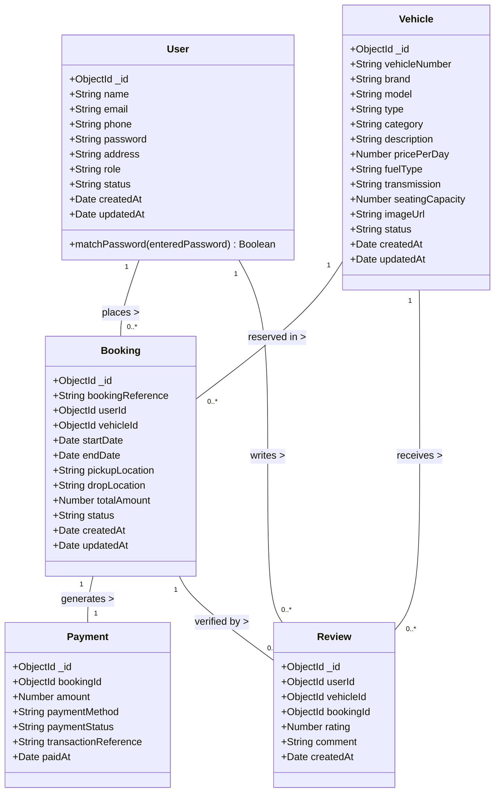

# Class Diagram & Domain Model — Online Vehicle Booking System

## Overview
The Class Diagram maps directly to the Mongoose schemas and domain models implemented in the Express backend.

---

## 1. Domain Class Diagram (Mermaid)

---

## 2. Multiplicity & Relationships
- **User to Booking**: 1 to Many (`1` -> `0..*`). A customer can place multiple bookings.
- **Vehicle to Booking**: 1 to Many (`1` -> `0..*`). A vehicle can be reserved in multiple non-overlapping booking periods.
- **Booking to Payment**: 1 to 1 (`1` -> `1`). Every booking generates a payment transaction record.
- **Review to Booking/Vehicle**: 1 to 1 (`1` -> `0..1`). A review is verified against a specific booking ID.
