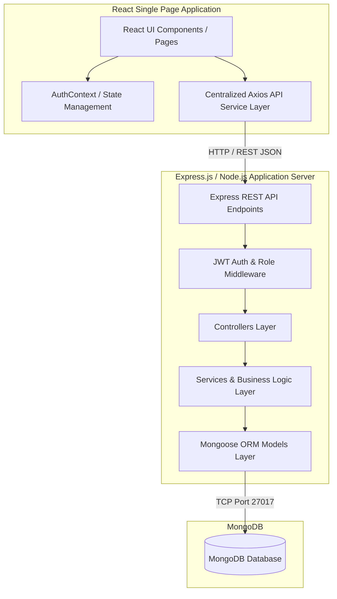

# Component Diagram — Online Vehicle Booking System

## Overview
The Component Diagram shows the physical structural components of the system and their dependencies.

---

## Component Diagram (Mermaid)

