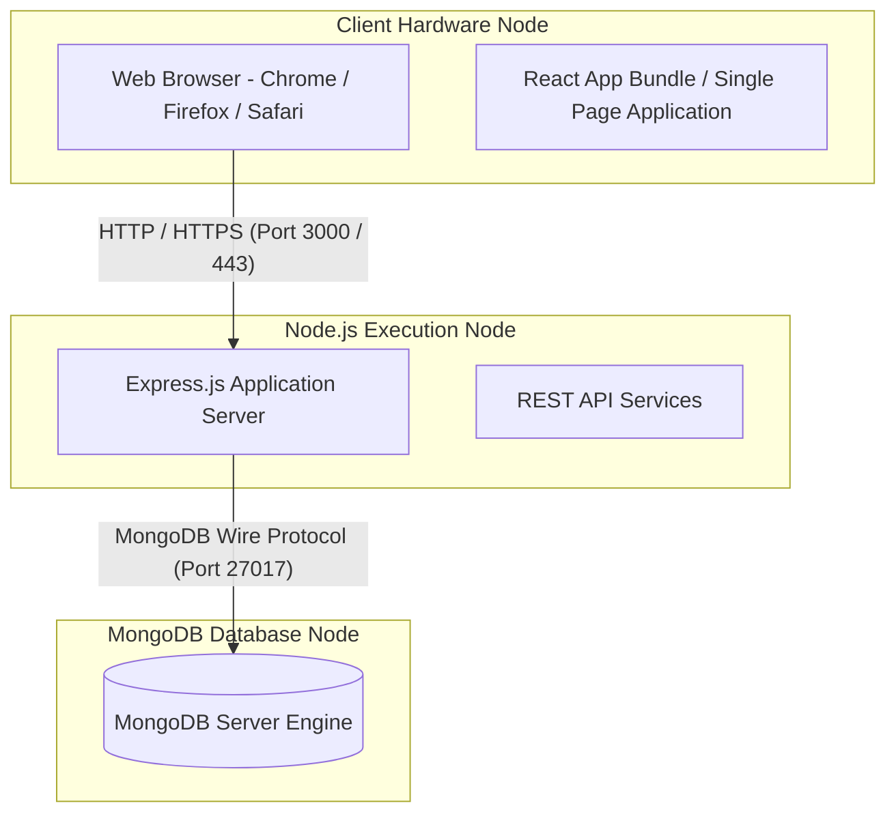

# Deployment Diagram — Online Vehicle Booking System

## Overview
The Deployment Diagram models the hardware nodes, execution environments, and network protocols connecting the software subsystems.

---

## Deployment Diagram (Mermaid)

