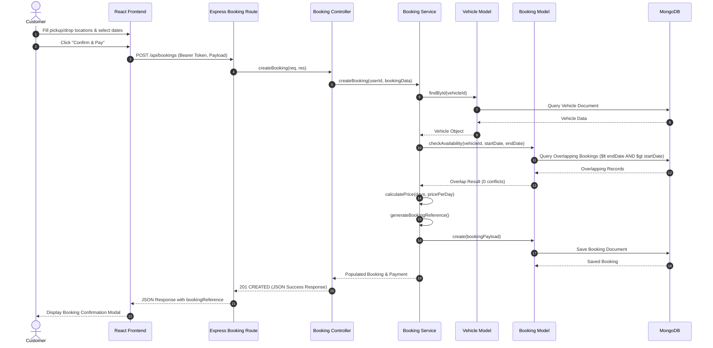
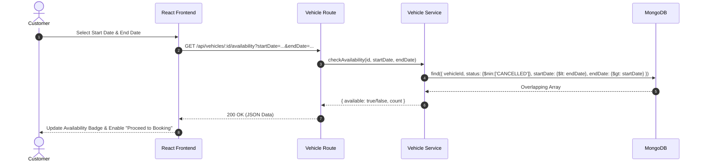

# Sequence Diagrams — Online Vehicle Booking System

## Overview
Sequence Diagrams trace the exact step-by-step object interactions and message exchanges across the layers during core workflows.

---

## 1. Vehicle Booking Sequence Diagram (Main Workflow)

---

## 2. Vehicle Availability Verification Sequence Diagram

