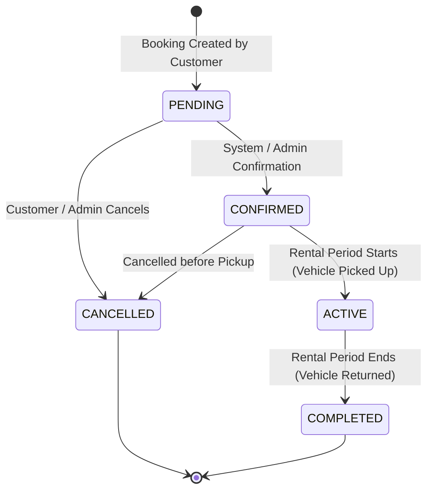

# State Chart Diagram — Online Vehicle Booking System

## Overview
The State Chart Diagram defines the lifecycle and state transitions of a **Booking** object within the system database and business logic.

---

## State Transition Diagram (Mermaid)

---

## State Transition Rules Matrix

| Current State | Target State | Trigger / Action | Authorization | Allowed? |
|---|---|---|---|---|
| `PENDING` | `CONFIRMED` | Automatic upon creation or Admin approval | Customer / Admin | ✅ YES |
| `PENDING` | `CANCELLED` | Customer cancels reservation | Customer / Admin | ✅ YES |
| `CONFIRMED` | `ACTIVE` | Vehicle handed over to customer | Admin | ✅ YES |
| `CONFIRMED` | `CANCELLED` | Cancelled prior to pickup | Customer / Admin | ✅ YES |
| `ACTIVE` | `COMPLETED` | Vehicle returned safely | Admin | ✅ YES |
| `ACTIVE` | `CANCELLED` | Attempt to cancel active rental | Customer | ❌ NO |
| `COMPLETED` | `CANCELLED` | Attempt to cancel completed rental | Anyone | ❌ NO |
