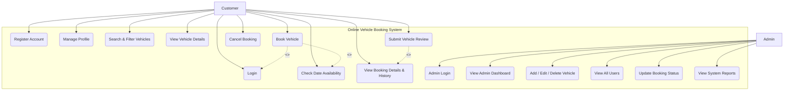

# Use Case Diagram & Specification — Online Vehicle Booking System

## Overview
The Use Case Diagram describes the functional requirements of the Online Vehicle Booking System from the perspective of two primary actors:
1. **CUSTOMER**
2. **ADMINISTRATOR**

---

## 1. Actors
- **Customer**: Registered user who searches vehicles, verifies availability date ranges, reserves vehicles, cancels bookings, and submits reviews.
- **Admin**: System administrator who manages vehicle catalog, user accounts, updates booking status flow, and views analytics reports.

---

## 2. Mermaid Use Case Diagram

---

## 3. ArgoUML Export Specification

### Use Case Descriptions:
- **UC-01: Check Availability**: Customer selects startDate and endDate. System queries active date ranges in MongoDB for double-booking overlaps.
- **UC-02: Confirm Booking**: System calculates `totalAmount = days * pricePerDay` on backend and creates Booking & Payment records.
- **UC-03: Update Status**: Admin changes booking state from `PENDING` -> `CONFIRMED` -> `ACTIVE` -> `COMPLETED` or `CANCELLED`.
